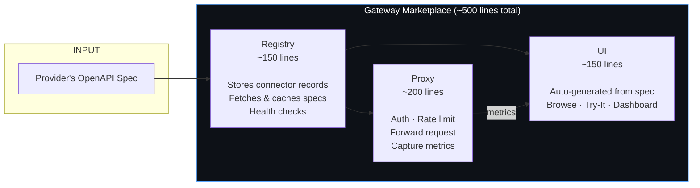
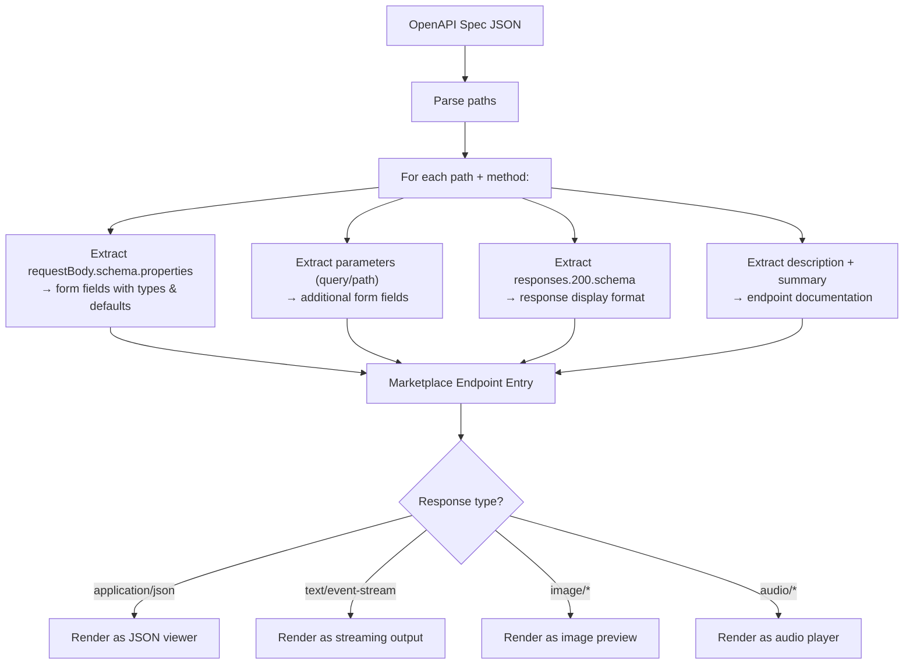
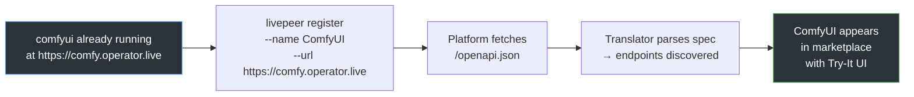

# Livepeer Gateway Marketplace — Flow

## Overview

A simplified marketplace where AI service providers (like Daydream) register their existing APIs, and the platform handles discovery, proxying, metrics, and UI — all derived from OpenAPI specs.

---

## End-to-End Flow

```mermaid
flowchart TD
    subgraph PROVIDER["🔧 Provider Side (e.g. Daydream)"]
        A[AI Service Code] --> B{How is the API built?}
        B -->|FastAPI / Flask| C1["@app.post('/generate')\ndef generate(prompt: str):\n    return model(prompt)"]
        B -->|Express / Hono| C2["app.post('/generate',\n  handler)"]
        B -->|Any framework| C3[Custom REST API]

        C1 --> D[Running API with OpenAPI spec]
        C2 --> D
        C3 --> D

        D --> E["Spec available at:\n/.well-known/openapi.json\nor provided manually"]
    end

    subgraph REGISTER["📋 Registration"]
        E --> F["livepeer register\n  --name Daydream\n  --url https://api.daydream.live\n  --openapi https://api.daydream.live/openapi.json"]

        F --> G["Connector Record Created"]

        G --> H["connector.json\n{\n  name: 'Daydream',\n  url: 'https://api.daydream.live',\n  openapi_spec: { paths, schemas },\n  pricing: { tier: 'free' },\n  provider: '0x...'\n}"]
    end

    subgraph TRANSLATOR["🔄 Translator Layer"]
        H --> I[OpenAPI Spec Parser]

        I --> J["Extract:\n• endpoints (paths + methods)\n• request schemas\n• response schemas\n• auth requirements"]

        J --> K[Normalize to Marketplace Schema]

        K --> L["Marketplace Entry\n{\n  service: 'Daydream',\n  endpoints: [\n    { POST /generate → form fields },\n    { GET /models → no input },\n    { POST /stream → SSE response }\n  ],\n  ui_hints: { fields, types, defaults }\n}"]
    end

    subgraph PROXY["⚡ Proxy + Metrics"]
        M[Consumer Request] --> N[Auth & API Key Check]
        N --> O[Rate Limit & Quota]
        O --> P["Route to Provider\nhttps://api.daydream.live/generate"]

        P --> Q[Capture Metrics]

        Q --> R["Metrics Record:\n• latency_ms\n• status_code\n• tokens_in / tokens_out\n• consumer_id\n• provider_id\n• timestamp"]

        R --> S[Return Response to Consumer]
        R --> T[(Metrics Store)]
    end

    subgraph UI["🖥️ Marketplace UI"]
        L --> U[Service Discovery Page]
        T --> U

        U --> V["Browse Services\n┌─────────────────┐\n│ Daydream        │\n│ Latency: 95ms   │\n│ Uptime: 99.8%   │\n│ [Try It] [Docs] │\n└─────────────────┘"]

        V --> W["Try-It Panel\n(auto-generated from OpenAPI)\n┌─────────────────────┐\n│ POST /generate      │\n│ prompt: [_________] │\n│ max_tokens: [512__] │\n│ [Execute]           │\n└─────────────────────┘"]

        V --> X["Provider Dashboard\n┌─────────────────────┐\n│ Requests: 12,847    │\n│ Revenue: $14.22     │\n│ p50: 95ms p99: 680ms│\n└─────────────────────┘"]
    end

    W -->|user clicks Execute| M

    style PROVIDER fill:#1a1a2e,stroke:#e94560,color:#fff
    style REGISTER fill:#1a1a2e,stroke:#0f3460,color:#fff
    style TRANSLATOR fill:#1a1a2e,stroke:#533483,color:#fff
    style PROXY fill:#1a1a2e,stroke:#e94560,color:#fff
    style UI fill:#1a1a2e,stroke:#0f3460,color:#fff
```

---

## The 3 Core Components

---

## Translator Detail: OpenAPI Spec → UI

The translator is the key piece — it turns any OpenAPI spec into a usable marketplace entry without writing provider-specific code.

---

## What This Replaces in naap

| naap today | Gateway Marketplace |
|---|---|
| Plugin per service (~500 lines each) | Connector JSON (~30 lines each) |
| Custom UI per plugin | Auto-generated from OpenAPI spec |
| Manual endpoint wiring | Translator reads spec, done |
| Plugin-specific metrics | Generic proxy captures everything |
| 12+ plugins, growing | 1 translator, unlimited services |

---

## Adding a New Service (e.g. ComfyUI)

**Zero code written. Zero plugins built. Just register and go.**
